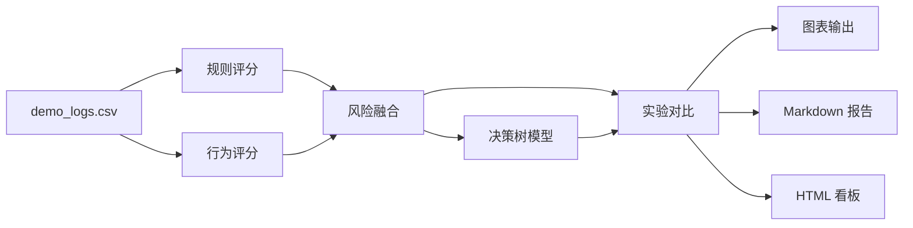

# NanoLLM4Audit 架构说明

## 1. 设计目标

- 采用六步主链路：数据、规则、行为、融合、决策树、图表
- 控制目录层级，降低首轮阅读成本
- 使用本地模板化审计摘要，复现结构化输出体验
- 采用固定随机种子，保障实验结果稳定

## 2. 流程图

## 3. 模块说明

- `src/nanoaudit/data.py`：生成小型演示日志集
- `src/nanoaudit/rules.py`：执行关键字规则匹配
- `src/nanoaudit/scoring.py`：计算行为分数与融合分数
- `src/nanoaudit/ml.py`：训练决策树、输出模型指标与规则文本
- `src/nanoaudit/experiments.py`：比较多种阈值与融合方案
- `src/nanoaudit/visuals.py`：输出十二张实验图
- `src/nanoaudit/report.py`：生成 Markdown 报告与 HTML 看板
- `src/nanoaudit/cli.py`：提供 `make-data`、`run`、`summary` 命令

## 4. 复现路径

1. 生成或加载 `data/demo_logs.csv`
2. 写出 `outputs/events_scored.csv`
3. 写出 `outputs/experiments.csv`
4. 训练决策树并写出 `outputs/tree_metrics.json`
5. 生成 `outputs/charts/`
6. 汇总到 `outputs/report.md` 与 `outputs/dashboard.html`
