# NanoLLM4Audit 实验报告

## 1. 数据概览
- 事件总量：334
- 标记为高风险的事件量：54
- 恶意样本量：54
- 融合方案 Precision：1.000
- 融合方案 Recall：1.000
- 融合方案 F1：1.000
- 融合方案误报率：0.000

## 2. 最佳实验方案
- 名称：fusion_balanced
- Precision：1.000
- Recall：1.000
- F1：1.000
- 评估范围：holdout_test

## 3. 决策树模型
- 模型：DecisionTreeClassifier
- 训练集大小：233
- 测试集大小：101
- Holdout Precision：1.000
- Holdout Recall：1.000
- Holdout F1：1.000
- Holdout Accuracy：1.000
- Holdout 误报率：0.000
- 树深度：2
- 叶子节点数：4
- 决策规则文本：`tree_rules.txt`

## 4. 阶段汇总

| attack_stage | event_count | avg_risk | detected |
| --- | --- | --- | --- |
| credential_access | 15 | 0.6625 | 15 |
| execution | 16 | 0.8721 | 16 |
| exfiltration | 7 | 0.8471 | 7 |
| lateral_movement | 8 | 0.8398 | 8 |
| normal_operation | 280 | 0.2064 | 0 |
| persistence | 8 | 0.8293 | 8 |

## 5. 实验表

| name | evaluation_scope | support | precision | recall | f1 | accuracy | fp_rate | selected_events | true_positive | false_positive | true_negative | false_negative |
| --- | --- | --- | --- | --- | --- | --- | --- | --- | --- | --- | --- | --- |
| rule_only | holdout_test | 101 | 1.0000 | 0.5000 | 0.6667 | 0.9208 | 0.0000 | 8 | 8 | 0 | 85 | 8 |
| behavior_only | holdout_test | 101 | 0.5000 | 1.0000 | 0.6667 | 0.8416 | 0.1882 | 32 | 16 | 16 | 69 | 0 |
| fusion_balanced | holdout_test | 101 | 1.0000 | 1.0000 | 1.0000 | 1.0000 | 0.0000 | 16 | 16 | 0 | 85 | 0 |
| fusion_sensitive | holdout_test | 101 | 0.8889 | 1.0000 | 0.9412 | 0.9802 | 0.0235 | 18 | 16 | 2 | 83 | 0 |
| fusion_precise | holdout_test | 101 | 1.0000 | 0.5000 | 0.6667 | 0.9208 | 0.0000 | 8 | 8 | 0 | 85 | 8 |
| decision_tree | holdout_test | 101 | 1.0000 | 1.0000 | 1.0000 | 1.0000 | 0.0000 | 16 | 16 | 0 | 85 | 0 |
| fusion_with_tree | holdout_test | 101 | 1.0000 | 1.0000 | 1.0000 | 1.0000 | 0.0000 | 16 | 16 | 0 | 85 | 0 |

## 6. 图表索引

- 图 1：日志来源与标签分布：`charts/01_source_overview.png`
  - 说明：用于观察不同日志来源的总体规模，以及恶意事件主要集中在哪些来源类型中。
  - 当前实验结论：恶意事件主要集中在 `process_creation`，共 32 条，来源分布具备明显聚集性。
- 图 2：风险分数分布：`charts/02_risk_distribution.png`
  - 说明：用于观察良性事件和恶意事件在风险分数上的分离程度，虚线右侧为更值得优先复核的区域。
  - 当前实验结论：恶意事件平均风险分数为 0.800，良性事件为 0.206；阈值以上的恶意命中率为 100.0%，良性误入率为 0.0%。
- 图 3：规则命中次数：`charts/03_rule_hits.png`
  - 说明：用于观察哪些规则命中最频繁，条形越长，说明该类攻击痕迹在数据中越突出。
  - 当前实验结论：当前数据中命中最多的规则为 `R007_BRUTE_FORCE`，共触发 50 次。
- 图 4：主机与来源风险热力图：`charts/04_host_heatmap.png`
  - 说明：用于观察哪些主机在特定日志来源上呈现较高平均风险，颜色越暖代表关注优先级越高。
  - 当前实验结论：`app-02` 在 `proxy` 来源上的平均风险最高，达到 0.847。
- 图 5：时间线：`charts/05_attack_timeline.png`
  - 说明：用于观察风险事件在时间维度上的聚集情况，峰值越明显，越容易定位集中发生的攻击窗口。
  - 当前实验结论：风险事件最集中的时间窗口为 `2026-03-02 00:00:00`，该窗口内高风险候选 15 条。
- 图 6：攻击阶段覆盖情况：`charts/06_stage_coverage.png`
  - 说明：用于比较各攻击阶段的真实恶意事件量与检测命中量，两组柱形越接近，说明覆盖越完整。
  - 当前实验结论：所有攻击阶段均实现 100% 命中，阶段覆盖保持完整。
- 图 7：融合方案混淆矩阵：`charts/07_confusion_matrix.png`
  - 说明：用于观察分类结果的四种情况，左上和右下数值越高，说明整体判定越稳定。
  - 当前实验结论：融合方案当前得到 TP=54、FP=0、TN=280、FN=0，整体判定稳定。
- 图 8：实验方案对比：`charts/08_experiment_comparison.png`
  - 说明：用于横向比较不同方案的 Precision、Recall 和 F1，便于快速选择更均衡的配置。
  - 当前实验结论：当前最优方案为 `fusion_balanced`，F1=1.000；次优方案为 `decision_tree`，F1=1.000。
- 图 9：筛选漏斗：`charts/09_funnel.png`
  - 说明：用于展示日志从总量到规则命中、行为增强、高风险候选、真实命中的逐步收缩过程。
  - 当前实验结论：日志由 334 条逐步收缩到规则命中 89 条、行为增强 119 条、最终真实命中 54 条。
- 图 10：决策树特征重要性：`charts/10_tree_feature_importance.png`
  - 说明：用于观察决策树更依赖哪些输入特征，数值越大，说明该特征对模型判断的贡献越明显。
  - 当前实验结论：决策树最依赖 `rule_score`（0.778），其次为 `off_hours_score`（0.222）。
- 图 11：决策树结构：`charts/11_tree_structure.png`
  - 说明：用于直接查看模型的判定路径，越靠近根节点的分裂条件，对结果的影响越显著。
  - 当前实验结论：当前树深度为 2，叶子节点数为 4，结构保持浅层，便于人工复核。
- 图 12：决策树分数分布：`charts/12_tree_score_distribution.png`
  - 说明：用于观察决策树输出概率对良性与恶意事件的区分程度，重叠越少，区分效果越直观。
  - 当前实验结论：恶意事件平均树分数为 1.000，良性事件为 0.000，两类事件具备清晰分离。

## 7. 图表展示

### 图 1：日志来源与标签分布

- 看图说明：用于观察不同日志来源的总体规模，以及恶意事件主要集中在哪些来源类型中。
- 当前实验结论：恶意事件主要集中在 `process_creation`，共 32 条，来源分布具备明显聚集性。

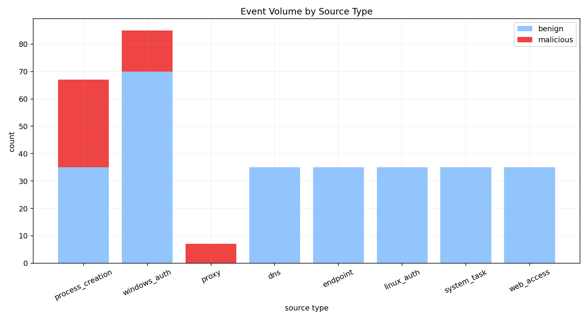

### 图 2：风险分数分布

- 看图说明：用于观察良性事件和恶意事件在风险分数上的分离程度，虚线右侧为更值得优先复核的区域。
- 当前实验结论：恶意事件平均风险分数为 0.800，良性事件为 0.206；阈值以上的恶意命中率为 100.0%，良性误入率为 0.0%。

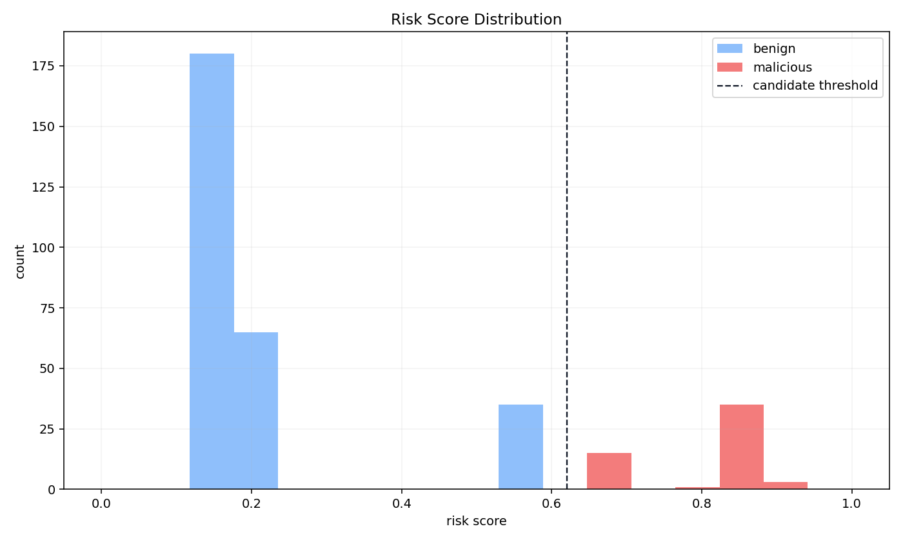

### 图 3：规则命中次数

- 看图说明：用于观察哪些规则命中最频繁，条形越长，说明该类攻击痕迹在数据中越突出。
- 当前实验结论：当前数据中命中最多的规则为 `R007_BRUTE_FORCE`，共触发 50 次。

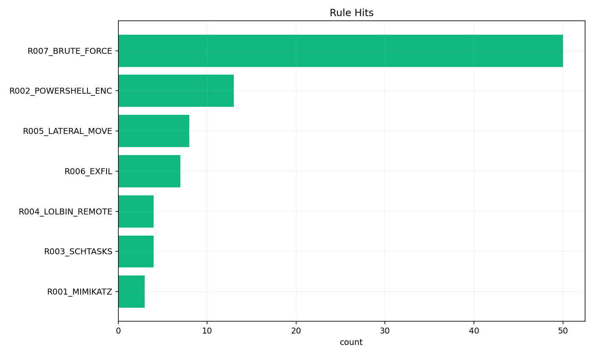

### 图 4：主机与来源风险热力图

- 看图说明：用于观察哪些主机在特定日志来源上呈现较高平均风险，颜色越暖代表关注优先级越高。
- 当前实验结论：`app-02` 在 `proxy` 来源上的平均风险最高，达到 0.847。

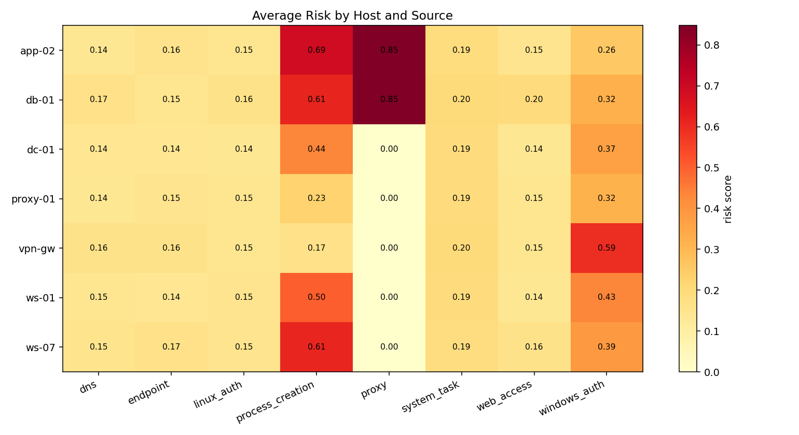

### 图 5：时间线

- 看图说明：用于观察风险事件在时间维度上的聚集情况，峰值越明显，越容易定位集中发生的攻击窗口。
- 当前实验结论：风险事件最集中的时间窗口为 `2026-03-02 00:00:00`，该窗口内高风险候选 15 条。

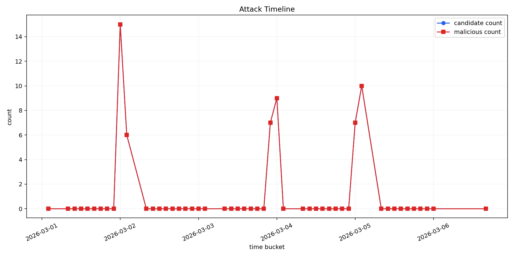

### 图 6：攻击阶段覆盖情况

- 看图说明：用于比较各攻击阶段的真实恶意事件量与检测命中量，两组柱形越接近，说明覆盖越完整。
- 当前实验结论：所有攻击阶段均实现 100% 命中，阶段覆盖保持完整。

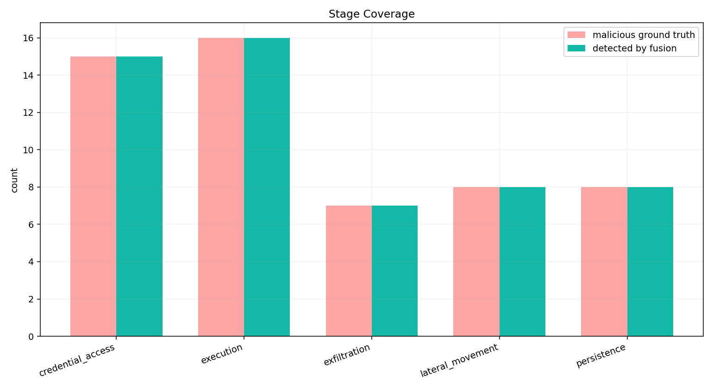

### 图 7：融合方案混淆矩阵

- 看图说明：用于观察分类结果的四种情况，左上和右下数值越高，说明整体判定越稳定。
- 当前实验结论：融合方案当前得到 TP=54、FP=0、TN=280、FN=0，整体判定稳定。

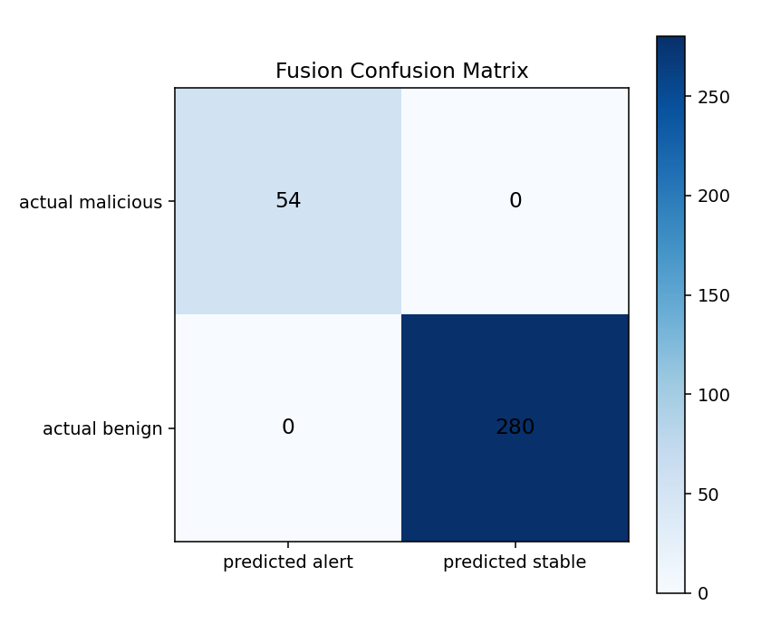

### 图 8：实验方案对比

- 看图说明：用于横向比较不同方案的 Precision、Recall 和 F1，便于快速选择更均衡的配置。
- 当前实验结论：当前最优方案为 `fusion_balanced`，F1=1.000；次优方案为 `decision_tree`，F1=1.000。

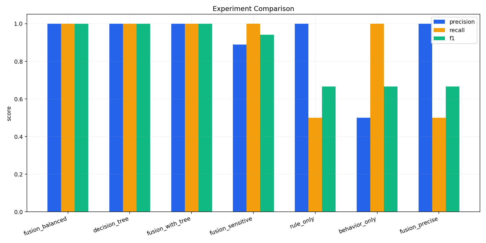

### 图 9：筛选漏斗

- 看图说明：用于展示日志从总量到规则命中、行为增强、高风险候选、真实命中的逐步收缩过程。
- 当前实验结论：日志由 334 条逐步收缩到规则命中 89 条、行为增强 119 条、最终真实命中 54 条。

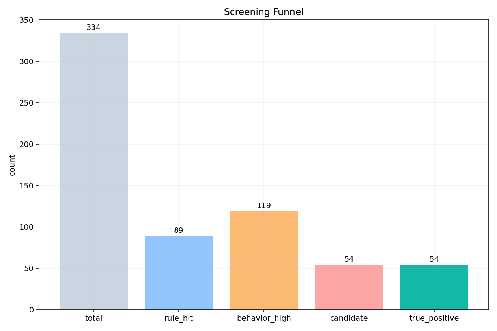

### 图 10：决策树特征重要性

- 看图说明：用于观察决策树更依赖哪些输入特征，数值越大，说明该特征对模型判断的贡献越明显。
- 当前实验结论：决策树最依赖 `rule_score`（0.778），其次为 `off_hours_score`（0.222）。

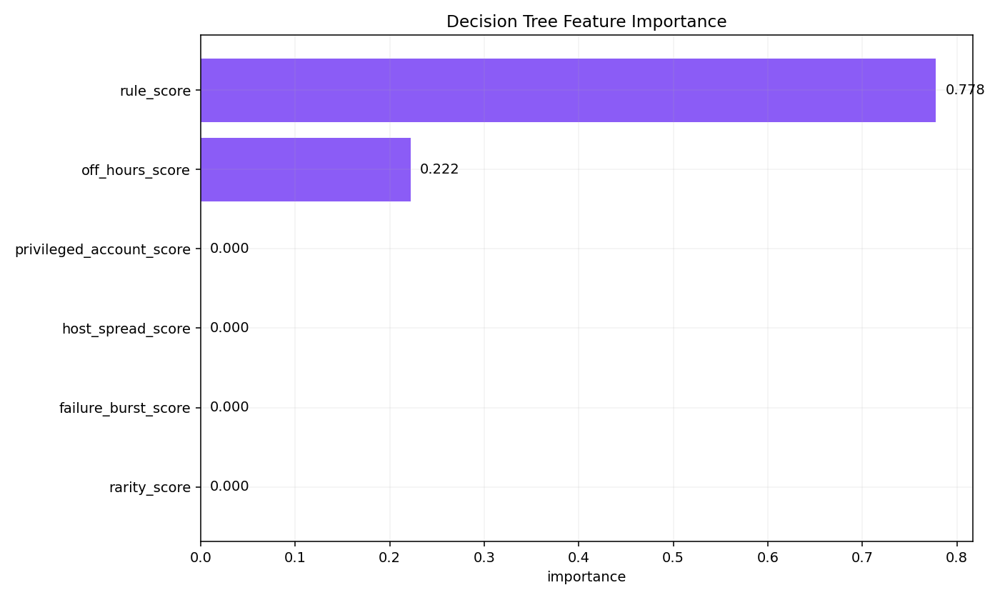

### 图 11：决策树结构

- 看图说明：用于直接查看模型的判定路径，越靠近根节点的分裂条件，对结果的影响越显著。
- 当前实验结论：当前树深度为 2，叶子节点数为 4，结构保持浅层，便于人工复核。

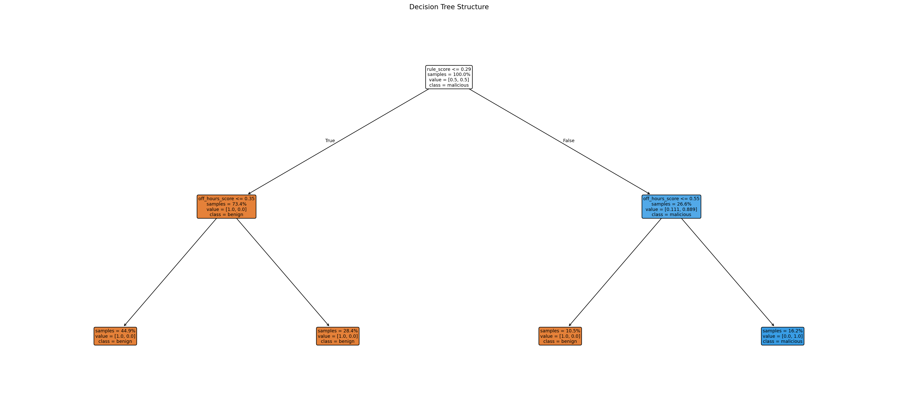

### 图 12：决策树分数分布

- 看图说明：用于观察决策树输出概率对良性与恶意事件的区分程度，重叠越少，区分效果越直观。
- 当前实验结论：恶意事件平均树分数为 1.000，良性事件为 0.000，两类事件具备清晰分离。

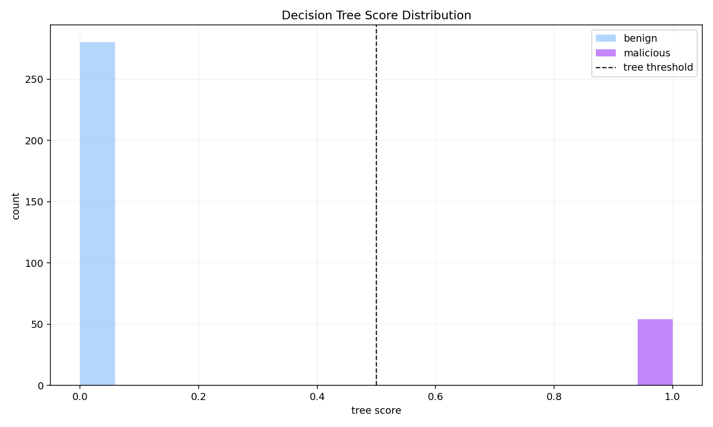
